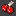

# Pacman

private Project of Pacman in java

## Verzeichnis  

* [conventions](#Convention)
  
* Concepts
  * [Animation](#animation)
  
* src
  * [ButtonListener.java](#buttonlistener)
  * [Ghost.java](#Ghost)
  * [Labyrinth.java](#Labyrinth)
  * [Main.java](#Main)
  * [Player.java](#player)
  * [PM.java](#pm-pacman)
  * [PMKeyListener.java](#pmkeylistenerinput)
  * [Setting.java](#setting)
  * [Ticker.java](#ticker)
  
* [Util](#character)

---

## Conventions

* Präfix
  * m_ ist privat. (private member)
  * Ohne ist public.
  * p_ ist protected.

---

## Animation

In der [Ticker](#ticker) Klasse wird die `draw()`-Methode den Klassen [`Labyrinth`](#labyrinth), [`Ghost`](#ghost) und [`Player`](#player) aufgerufen

Zum Schluss wird der __Score__ angezeigt, der unter _PM_ als __PM.Point_Text__ gespeichert wird:

```java
m_g.setColor(Color.black);
m_g.drawString(PM.Point_Text, 650, 50); 
```

---

## src

---

## ButtonListener

Verantwortlich für den Start-Knopf und startet das Spiel demnach durch `m_pm.startGame();`.  

---

## Ghost

Geister Klasse benutzt das enum GHOSTTYPE, um zwischen den Geistern zu unterscheiden.

Jeder Geist hat ein `Target` und `m_targetPosition`, dass zum Beispiel die Position des Spielers oder der Basis der Geister sein kann.

Vom Ticker kommt das `tick()`-Signal an und der Geist wird bewegt, wenn nicht der `m_fairnessTimer` aktiv ist, der die Geiser anhählt am Anfang des Spiels und wenn sie sterben.

Der Geist bewegt sich in Richtung des Spielers mit:

```java
float dx = m_targetPosition.get(M_AXIS.X) - getX() + (float)(Math.random()-0.5)*5;  

float dy = m_targetPosition.get(M_AXIS.Y) - getY() + (float)(Math.random()-0.5)*5;
```

Daraus wird der geringere Wert genommen für die Richtung in M_AXIS und forward.

---

## Labyrinth

Aufgabe der Datei ist es auf das Labyrinth und die Felder aufzupassen und diese zu zeichnen.

 |Zahl | Objekt|  |
 |---|---|---|
 |0|Leer|  |
 |1|Wand|  |
 |2|Kirsche|  |
 |3|normaler-Punkt|  |
 |4|Unbesiegbarkeits-Punkt|  |
 |5|Tür für Geister|  |

Außerdem wird hier noch ein Großteil des HUD gezeichnet.

Es gibt immer ein aktives Labyrinth/Level, was mit `setActive()` geändert wird.

1. `tick()`
  wird vom Ticker gecallt und überprüft, ob gewonnen wurde.

2. `draw()`
   kommt danach und malt:
   * Besetzung
   * HUD

---

## Main

Erstellt PM.

---

## Player

```java
private int mundState;
private int facingangle;
private int lives;

private int invTimer = 0;
private SoundManager sManager;
```

> mundstate

ist entweder 1 oder 0 und sagt, wie der Mund gemalt werden soll.

> facing angle

|facingangle|Richtung|
|---|---|  
| 0 | right |  
|1|down|  
|2|left|  
|3|up|

> lives

Leben von Pac Man, startet bei `Setting.Lives`

> invTimer

wird von Unbesiegbarkeitspille gesetzt und zählt dann jeden Tick runter. Wenn das größer als null ist, its PacMan unbesiegbar.

> sManager

allein dafür da die Musik zu stoppen, wenn PacMan stirbt.  

---

## PM (PacMan)

Ist für das Programm zuständig.

* erstellt das Fenster
  * erstellt den Button

* startet das Spiel
  * macht [Button](#buttonlistener) unsichtbar
  * erstellt den [Timer](#ticker)
  * holt `Graphics`
  * erstellt SoundManager
  * erstellt [Labyrinth](#labyrinth)
  * Objekte [Player](#player) und Geister erstellen.
  * fügt input dem Eingabefeld zu.
  * lässt den Tickervon allen [tickable](#Tickable) wissen.
  * setzt den Focus vom User auf das Spielfeld.
  * startet den Timer.

---

## PMKeyListener(Input)

dreht den player in die richtige Richtung.

---

## Setting

Einstellungen

---

### SoundManager

erstellt Sound.

Um Hintergrund-Musik hinzuzufügen, muss in assets eine Datei namens `BGMusic.wav` (oder was auch immer in `Setting.MusicFilePath` ist) hinzugefügt werden, die dann auf Dauerschleife läuft.

---

## Ticker

folgt dem [Observer](<https://www.tutorialspoint.com/design_pattern/observer_pattern.htm>) pattern:

Es gibt Observer, die wenn sich das Objekt verändert, eine Nachricht bekommen.

Der Ticker ist dabei das Objekt, dass alle benachrichtigt, die es anschauen(appended sind).

Dafür hat es

```java
private List<Tickable> tickables = new ArrayList<Tickable>();
```

was die Liste aller Objekte sind, die bei einem `tick()` benachrichtigt werden sollen.

Diese werden in die Liste in `append()` mit aufgenommen, was in [PM](#pm-pacman) aufgerufen wird.

Es wird immer zuerst die `tick()` Funktion der Klassen aufgerufen und dann gemalt, um Die Tode von Geistern/Pacman richtig anzuzeigen.

### Tickable

sind die Klassen, die vom Tick-Cycle betroffen sind und neu gemalt werden sollen.

Dafür müssen sie eine `draw()` und `tick()`-Methode enthalten, die dann vom Ticker aufgerufen werden.

---

## Utilities

---

## Character

Klasse von der sowohl Geister als auch der Player erbt.

kümmert sich um die Position des Spielers mit

* `move()`
* `setPosition()`
* `getX()`
* `getY()`
* `getWindowXCoord()`
* `getWindowYCoorc()`

## Position

speichert und geht mit der X und Y Koordinate aller Objekte um.

* `get()`
* `set()`
* `move()`

Sowie es die M_AXIS besitzt, alse X oder Y-Achse.
